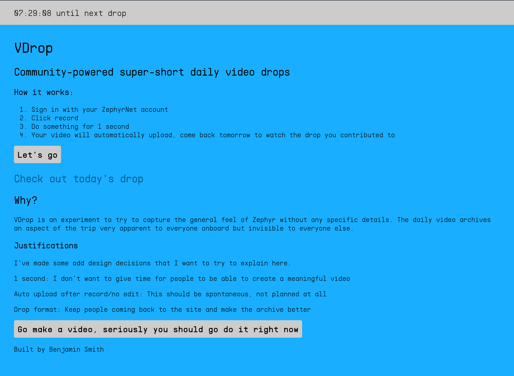

# VDrop

VDrop allows users to record a single 1-second video every day. The next day, all of the videos are combined into a single "drop" which is released on the site. It was created for [the Hacker Zephyr](https://zephyr.hackclub.com/), a hackathon run by [Hack Club](https://hackclub.com/) that took place on a trans-atlanic train in the summer of 2021. We had very limited access to the internet so code here is likely messy/unpolished and not reflective of what I'd make for a longer term project.  VDrop is built using Next.js/React/TypeScript. I also built my own UI library using `makeStyles` as well as an advanced [`styled`](/src/ui/theme.tsx) function to make it really easy to build UI components. I may eventually extract this out into its own repository, but for now it is only in this repo.